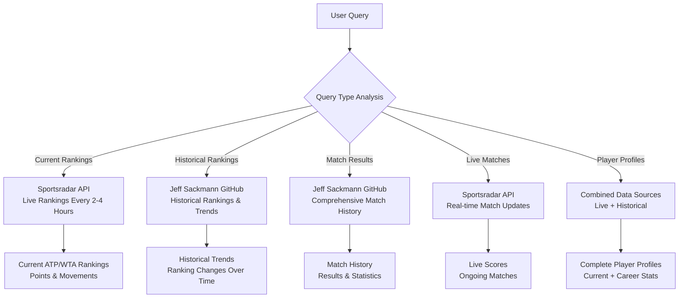

# AskTennis Migration Strategy: Sportsradar API to Jeff Sackmann GitHub Repositories

## Overview

This document outlines the comprehensive migration strategy from Sportsradar API to Jeff Sackmann's tennis GitHub repositories, with a hybrid approach that maintains live data capabilities while leveraging rich historical datasets.

## Current System Analysis

### Architecture
- **Database**: PostgreSQL with comprehensive schema supporting players, rankings, tournaments, matches, and complex XSD-based data structures
- **API Integration**: Sportsradar API providing real-time data with automatic syncing every 24 hours
- **Query Processing**: AI-powered query handler with caching and fallback mechanisms
- **Data Sync**: Sophisticated data synchronization service handling live updates

### Current Data Flow
```
Sportsradar API → DataSync Service → PostgreSQL Database → AI Query Handler → User Response
```

## Jeff Sackmann Repository Data Available

### Available Repositories
1. **tennis_atp** - ATP rankings, results, and statistics
2. **tennis_wta** - WTA rankings, results, and statistics  
3. **tennis_slam_pointbypoint** - Point-by-point Grand Slam data (2011-current)
4. **tennis_MatchChartingProject** - User-submitted point-by-point match data
5. **tennis_misc** - Tennis algorithms and miscellaneous data
6. **tennis_viz** - Tennis analytics visualizations

### Data Format
- **Format**: CSV files with consistent structure
- **Update Frequency**: Periodic updates (not real-time)
- **Coverage**: Comprehensive historical data
- **Cost**: Free access

## Migration Feasibility Assessment

### ✅ Advantages of Migration

1. **Cost Savings**: 
   - Eliminate Sportsradar API subscription costs
   - Free access to comprehensive historical data

2. **Rich Historical Data**:
   - Extensive historical rankings and results
   - Point-by-point match data for Grand Slams
   - More comprehensive player statistics

3. **Data Quality**:
   - Well-maintained, clean CSV datasets
   - Consistent data structure across repositories
   - High-quality historical data for analysis

4. **No Rate Limits**:
   - No API rate limiting concerns
   - Can process large datasets without restrictions

### ⚠️ Challenges to Address

1. **Real-time Data Loss**:
   - No live match updates
   - Rankings updated periodically (not real-time)
   - No live tournament schedules

2. **Data Update Frequency**:
   - Manual updates required
   - Need to implement automated data fetching from GitHub

3. **Data Structure Differences**:
   - CSV format vs. JSON API responses
   - Need to adapt data parsing logic

## Recommended Hybrid Strategy

### Data Source Distribution




### Core Principle: Live Rankings + Historical Data

- **Live Rankings**: Use Sportsradar API for current rankings (frequent updates every 2-4 hours)
- **Historical Data**: Use GitHub repositories for historical analysis, trends, and comprehensive statistics
- **Smart Routing**: AI query handler determines optimal data source based on query type

## Implementation Strategy

### Phase 1: Enhanced Data Sync Service

```javascript
// src/dataSync.js - Enhanced version
class DataSyncService {
  constructor() {
    this.liveDataInterval = 2 * 60 * 60 * 1000; // 2 hours for live data
    this.historicalDataInterval = 7 * 24 * 60 * 60 * 1000; // 7 days for historical
  }

  async syncLiveData() {
    // High-frequency sync for current rankings
    const liveData = await sportsradar.getAllData();
    await this.updateCurrentRankings(liveData);
  }

  async syncHistoricalData() {
    // Low-frequency sync for historical data
    const historicalData = await githubDataService.fetchHistoricalData();
    await this.updateHistoricalData(historicalData);
  }

  async updateCurrentRankings(liveData) {
    // Update only current rankings table with live data
    // Mark as 'live' source
  }

  async updateHistoricalData(historicalData) {
    // Update historical rankings, match results, etc.
    // Mark as 'historical' source
  }
}
```

### Phase 2: GitHub Data Service

```javascript
// src/githubDataService.js
class GitHubDataService {
  constructor() {
    this.baseUrl = 'https://raw.githubusercontent.com/JeffSackmann';
    this.repositories = {
      atp: 'tennis_atp',
      wta: 'tennis_wta',
      slam: 'tennis_slam_pointbypoint',
      charting: 'tennis_MatchChartingProject'
    };
  }

  async fetchRankings(tour = 'ATP') {
    const repo = tour === 'ATP' ? this.repositories.atp : this.repositories.wta;
    const url = `${this.baseUrl}/${repo}/main/${tour.toLowerCase()}_rankings_current.csv`;
    return await this.fetchAndParseCSV(url);
  }

  async fetchHistoricalRankings(tour = 'ATP', year = null) {
    // Fetch historical rankings data
  }

  async fetchMatchResults(tour = 'ATP', year = null) {
    // Fetch match results and statistics
  }

  async fetchAndParseCSV(url) {
    // Parse CSV data and return structured objects
  }
}
```

### Phase 3: Smart Query Routing

```javascript
// Enhanced query handler
async processQuery(question) {
  const analysis = await this.analyzeQuery(question);
  
  if (analysis.needsLiveData) {
    // Use Sportsradar for current rankings
    return await this.queryLiveRankings(question);
  } else if (analysis.isHistorical) {
    // Use GitHub data for historical analysis
    return await this.queryHistoricalData(question);
  } else if (analysis.isCombined) {
    // Combine both sources for comprehensive answers
    return await this.queryCombinedData(question);
  }
}

analyzeQuery(question) {
  const lowerQuestion = question.toLowerCase();
  
  return {
    needsLiveData: /current|latest|now|today|rank.*\d+|number.*\d+/i.test(question),
    isHistorical: /historical|past|previous|trend|compare|over.*time/i.test(question),
    isCombined: /profile|career|statistics|analysis/i.test(question)
  };
}
```

### Phase 4: Database Schema Enhancement

```sql
-- Add data source tracking
ALTER TABLE rankings ADD COLUMN data_source VARCHAR(20) DEFAULT 'live';
ALTER TABLE rankings ADD COLUMN is_current BOOLEAN DEFAULT true;

-- Create historical rankings table
CREATE TABLE historical_rankings (
  id SERIAL PRIMARY KEY,
  player_id INTEGER REFERENCES players(id),
  ranking INTEGER NOT NULL,
  points INTEGER,
  tour VARCHAR(10),
  ranking_date DATE NOT NULL,
  data_source VARCHAR(20) DEFAULT 'historical',
  created_at TIMESTAMP DEFAULT CURRENT_TIMESTAMP
);

-- Create match results table for GitHub data
CREATE TABLE match_results (
  id SERIAL PRIMARY KEY,
  tournament_name VARCHAR(255),
  player1_name VARCHAR(255),
  player2_name VARCHAR(255),
  winner_name VARCHAR(255),
  score VARCHAR(100),
  match_date DATE,
  round VARCHAR(50),
  surface VARCHAR(20),
  data_source VARCHAR(20) DEFAULT 'historical',
  created_at TIMESTAMP DEFAULT CURRENT_TIMESTAMP
);
```

## Query Examples and Data Source Routing

### Live Data Queries (Sportsradar API)
- "Who is ranked #1?"
- "What is the current ATP ranking?"
- "Show me today's live matches"
- "Who is playing right now?"

### Historical Data Queries (GitHub Repositories)
- "How has Djokovic's ranking changed over the years?"
- "Show me historical Grand Slam winners"
- "Compare last year's top 10 with this year's"
- "What are the all-time Grand Slam records?"

### Combined Data Queries (Both Sources)
- "Show me Djokovic's complete career profile"
- "Compare current top 5 with historical trends"
- "Analyze player performance over time"
- "Career statistics and current form"

## Benefits of Hybrid Approach

### ✅ Advantages
- **Always Current Rankings**: Users get the latest rankings instantly
- **Rich Historical Analysis**: Deep insights from comprehensive historical data
- **Cost Optimized**: Use expensive live API only for what needs to be live
- **Enhanced User Experience**: More comprehensive and accurate answers
- **Scalable**: Can add more data sources as needed

### 📊 Cost Optimization
- **Sportsradar API**: Use only for live rankings (reduced API calls)
- **GitHub Data**: Free historical data
- **Result**: Significant cost reduction while maintaining live functionality

## Implementation Timeline

### Phase 1: Foundation (Week 1-2)
- [ ] Create GitHub data service
- [ ] Implement CSV parsing utilities
- [ ] Set up historical data tables

### Phase 2: Integration (Week 3-4)
- [ ] Integrate GitHub data fetching
- [ ] Implement historical data sync
- [ ] Update data sync service

### Phase 3: Smart Routing (Week 5-6)
- [ ] Enhance query analysis
- [ ] Implement data source routing
- [ ] Add combined query capabilities

### Phase 4: Optimization (Week 7-8)
- [ ] Performance optimization
- [ ] Error handling and fallbacks
- [ ] Monitoring and logging

## Monitoring and Maintenance

### Data Quality Monitoring
- Track data freshness for live sources
- Monitor historical data completeness
- Validate data consistency between sources

### Performance Metrics
- Query response times by data source
- API usage and costs
- User satisfaction with answer quality

### Maintenance Tasks
- Regular GitHub repository updates
- API key management for Sportsradar
- Database optimization and cleanup

## Conclusion

This hybrid approach provides the optimal balance between:
- **Live data accuracy** (Sportsradar API for current rankings)
- **Rich historical insights** (GitHub repositories for comprehensive analysis)
- **Cost efficiency** (Reduced API usage, free historical data)
- **Enhanced user experience** (More comprehensive and accurate answers)

The migration is not only feasible but will significantly enhance the application's capabilities while reducing operational costs. The existing database schema and query system are well-designed to handle this transition smoothly.

## Next Steps

1. **Immediate**: Implement GitHub data service and CSV parsing
2. **Short-term**: Integrate historical data sync with existing system
3. **Medium-term**: Deploy smart query routing and combined data queries
4. **Long-term**: Optimize performance and add advanced analytics features

---

*Document created: January 2025*
*Last updated: January 2025*
*Status: Ready for Implementation*
